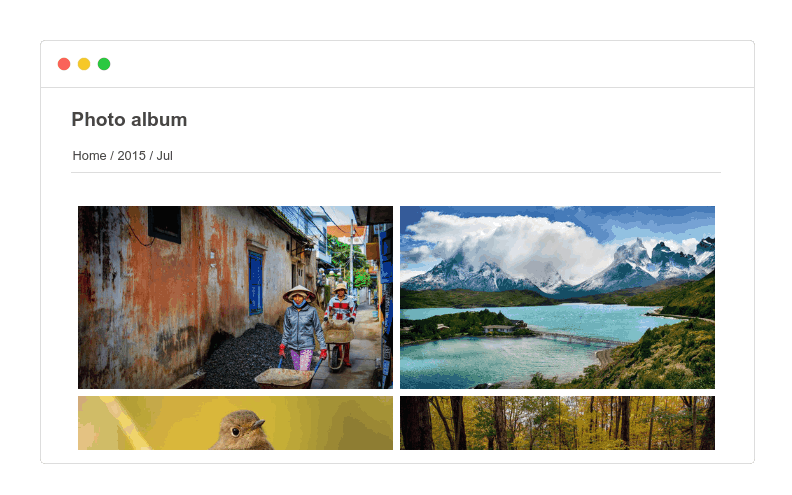

# @thumbsup/theme-flow

[](https://www.npmjs.com/package/@thumbsup/theme-flow)
[](https://travis-ci.org/thumbsup/theme-flow)

One of the built-in themes for https://github.com/thumbsup/thumbsup.

---

## Usage

```bash
thumbsup --theme flow
```

## Theme options

- The `featuredAlbum` option will show the album with the specified name (if it exists)
as a slider at the top of the gallery homepage instead of listing it as a normal album.
This album must be top-level, and any sub-albums will be ignored.
The height of this slider defaults to 400px, but can be overridden
by setting the `@slider-height` LESS variable.
- The `sliderInterval` option is an integer representing the number of
milliseconds to wait between slides. The default is 1000 (1 second).  
- The `hideExtension` option will display media filenames without the file extension.

## Screenshots




## Developing

Testing the theme

```bash
thumbsup --input /photos --output ./tmp --theme-path ./theme
```

Publishing the theme:

```bash
npm publish --access=public
```
